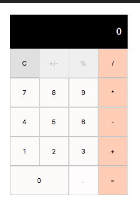

# React Calculator App

[](https://codecov.io/gh/manelpb/react-calculator)

[](https://circleci.com/gh/manelpb/react-calculator)

### Project goal

Create calculator application

To see this project, access: https://manelpb.github.io/react-calculator/index.html



### Requirements
- Numerical input
- Via keyboard and click

- Basic operations
  - Add
  - Subtract
  - Divide
  - Multiply
  - Display result of operation

### How to build this project

Execute the following:

- ```npm install```
- ```npm start```